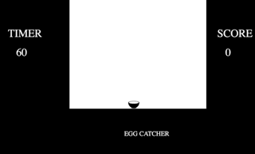

# Egg Catcher

Play Game here : https://github.com/Swathign/Egg-Catcher

## Getting Started
### Cloning the repository 
```
git clone https://github.com/Swathign/Egg-Catcher.git
$ mkdir egg-catcher
$ cd egg-catcher
$ npm i
$ bower i
```


### Running the Project
```
$ npm start
```
Open http://localhost:8080 in your browser

## Preview

